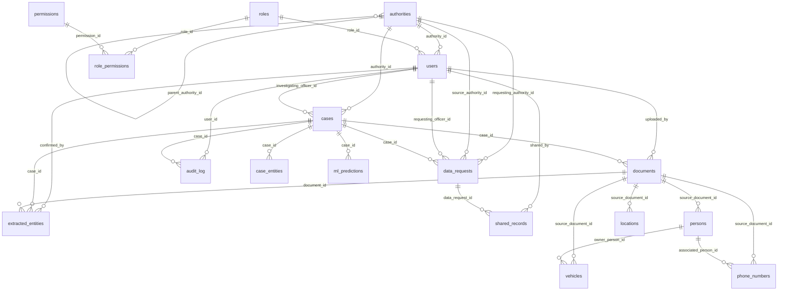

# TRACE-X PostgreSQL Relational Database Schema

## 1. Overview & Frontend Architecture Alignment

The TRACE-X relational database schema provides strict persistence, referential integrity, and statutory audit compliance for the **TRACE-X Criminal Network Analysis & Investigation Platform** (Local Authority tier). Every model, enumeration, and foreign key relationship is designed to map directly to the existing frontend workflows under `/dashboard` onward:

- **Dashboard & Case Registry (`/dashboard`, `/cases`)**: Supported by `cases`, `users`, `authorities`, and `case_entities`.
- **New Case 5-Step Wizard (`/cases/new`)**:
  - *Details Step*: `cases`
  - *Upload Step*: `documents`
  - *Extract & Review Steps*: `extracted_entities`
- **Case Workspace & Entity Profiles (`/cases/:id`, `/persons/:id`)**: Supported by `persons`, `vehicles`, `locations`, `phone_numbers`, and `case_entities`, utilizing the exact `SourceType` badges (`VERIFIED_RECORD`, `SYSTEM_DERIVED`, `AI_ANALYSIS`).
- **Missing Link Analysis (`/cases/:id/missing-links`)**: Backed by `ml_predictions` with calibrated probabilities, evidence strength rankings (`Strong`, `Moderate`, `Limited`), explanation basis, and SHAP feature importance vectors.
- **Inter-Agency Requisitions (`/requests`, `/incoming/:id`, `/received`)**: Supported by `data_requests` and `shared_records` with 30-day temporal access expiry.
- **Statutory Audit Trail (`/audit`)**: Backed by `audit_log` with database-level append-only triggers preventing any modification or record deletion.

---

## 2. Entity Relationship Diagram



---

## 3. Enumerations

| Enum Name | Allowed Values | Usage / UI Mapping |
|---|---|---|
| `authority_type` | `LOCAL`, `STATE`, `CENTRAL` | Authority Selection `/login` cards |
| `case_status` | `ACTIVE`, `UNDER_ANALYSIS`, `PENDING_REVIEW`, `CLOSED`, `RESOLVED` | `StatusBadge` in Case Workspace and Cases Table |
| `priority_level` | `CRITICAL`, `HIGH`, `MEDIUM`, `LOW` | Case priority badges and attention filters |
| `source_type` | `VERIFIED_RECORD`, `SYSTEM_DERIVED`, `AI_ANALYSIS` | `SourceBadge` in Person Dossier and Network Inspector |
| `document_status` | `Processing`, `Processed`, `Failed` | New Case Wizard Upload Data Step status |
| `data_request_status` | `Pending`, `Under Review`, `Approved`, `Rejected`, `Data Sent`, `Received` | Requisition ledger status pill |
| `urgency_level` | `HIGH`, `ROUTINE` | Requisition urgency flag |
| `evidence_strength` | `Strong`, `Moderate`, `Limited` | Missing Link Analysis candidate badge |
| `person_status` | `SUSPECT`, `PERSON_OF_INTEREST`, `ASSOCIATE`, `WITNESS`, `VICTIM` | Person profile classification |
| `risk_level` | `HIGH`, `ELEVATED`, `STANDARD`, `LOW` | Person dossier threat rating |
| `prediction_status` | `PENDING_REVIEW`, `CONFIRMED`, `DISMISSED` | Candidate review adjudication state |

---

## 4. Tables & Column Specifications

### 4.1. `authorities`
Organisational hierarchy of investigative law enforcement bodies.
- `id` (`UUID`, PK)
- `name` (`VARCHAR(255)`, UNIQUE, NOT NULL, INDEX) — e.g. `"Central Division Police Station, Zone 3"`
- `type` (`authority_type`, NOT NULL, INDEX)
- `jurisdiction` (`VARCHAR(255)`, NOT NULL)
- `parent_authority_id` (`UUID`, FK `authorities.id`, NULLABLE, INDEX)
- `created_at` (`TIMESTAMPTZ`, DEFAULT `now()`, NOT NULL)
- `updated_at` (`TIMESTAMPTZ`, DEFAULT `now()`, NOT NULL)

### 4.2. `roles`, `permissions`, `role_permissions`
Role-Based Access Control (RBAC) definitions.
- **`roles`**: `id` (`UUID`, PK), `name` (`VARCHAR(100)`, UNIQUE, NOT NULL, INDEX), `description` (`TEXT`), timestamps.
- **`permissions`**: `id` (`UUID`, PK), `code` (`VARCHAR(100)`, UNIQUE, NOT NULL, INDEX), `description` (`TEXT`), timestamps.
- **`role_permissions`**: `role_id` (`UUID`, FK `roles.id`), `permission_id` (`UUID`, FK `permissions.id`), composite PK.

### 4.3. `users`
Investigative officers and station personnel authenticated via Keycloak OIDC.
- `id` (`UUID`, PK)
- `keycloak_sub` (`VARCHAR(255)`, UNIQUE, NOT NULL, INDEX) — Keycloak subject claim
- `name` (`VARCHAR(255)`, NOT NULL, INDEX) — e.g. `"Insp. Vikram Deshmukh"`
- `email` (`VARCHAR(255)`, UNIQUE, NULLABLE, INDEX)
- `role` (`VARCHAR(100)`, NOT NULL) — Functional title e.g. `"Senior Investigating Officer"`
- `role_id` (`UUID`, FK `roles.id`, NULLABLE, INDEX)
- `authority_id` (`UUID`, FK `authorities.id`, NOT NULL, INDEX)
- `badge_id` (`VARCHAR(100)`, NOT NULL, INDEX) — e.g. `"MH-POL-4412"`
- `is_active` (`BOOLEAN`, DEFAULT `TRUE`, NOT NULL)
- `created_at` (`TIMESTAMPTZ`, DEFAULT `now()`, NOT NULL)
- `updated_at` (`TIMESTAMPTZ`, DEFAULT `now()`, NOT NULL)

### 4.4. `cases`
Core criminal investigation dossiers.
- `id` (`UUID`, PK)
- `case_number` (`VARCHAR(100)`, UNIQUE, NOT NULL, INDEX) — e.g. `"CASE-2026-0891"`, `"TRX-2026-0142"`
- `fir_number` (`VARCHAR(100)`, NULLABLE, INDEX) — e.g. `"FIR #18/26"`
- `title` (`VARCHAR(255)`, NOT NULL)
- `crime_type` (`VARCHAR(150)`, NOT NULL, INDEX)
- `status` (`case_status`, NOT NULL, DEFAULT `ACTIVE`, INDEX)
- `priority` (`priority_level`, NOT NULL, DEFAULT `MEDIUM`, INDEX)
- `police_station` (`VARCHAR(255)`, NOT NULL)
- `location` (`VARCHAR(255)`, NOT NULL)
- `description` (`TEXT`, NULLABLE)
- `investigating_officer_id` (`UUID`, FK `users.id`, NOT NULL, INDEX)
- `authority_id` (`UUID`, FK `authorities.id`, NOT NULL, INDEX)
- `requires_attention` (`BOOLEAN`, DEFAULT `FALSE`, NOT NULL)
- `attention_reason` (`TEXT`, NULLABLE)
- `created_at` (`TIMESTAMPTZ`, DEFAULT `now()`, NOT NULL, INDEX)
- `updated_at` (`TIMESTAMPTZ`, DEFAULT `now()`, NOT NULL)

### 4.5. `documents`
Uploaded forensic evidence files, case diaries, and data sheets.
- `id` (`UUID`, PK)
- `case_id` (`UUID`, FK `cases.id`, NOT NULL, INDEX)
- `filename` (`VARCHAR(255)`, NOT NULL)
- `file_type` (`VARCHAR(50)`, NOT NULL) — e.g. `"PDF"`, `"CSV"`, `"CDR"`
- `storage_path` (`VARCHAR(500)`, NOT NULL)
- `file_size_bytes` (`BIGINT`, NULLABLE)
- `processing_status` (`document_status`, NOT NULL, DEFAULT `Processing`, INDEX)
- `uploaded_by` (`UUID`, FK `users.id`, NOT NULL, INDEX)
- `created_at` (`TIMESTAMPTZ`, DEFAULT `now()`, NOT NULL)
- `updated_at` (`TIMESTAMPTZ`, DEFAULT `now()`, NOT NULL)

### 4.6. `extracted_entities`
Named entities extracted from documents during the New Case 5-step wizard.
- `id` (`UUID`, PK)
- `document_id` (`UUID`, FK `documents.id`, NOT NULL, INDEX)
- `case_id` (`UUID`, FK `cases.id`, NOT NULL, INDEX)
- `entity_type` (`VARCHAR(50)`, NOT NULL, INDEX) — `PERSON`, `PHONE`, `VEHICLE`, `LOCATION`
- `raw_value` (`VARCHAR(255)`, NOT NULL)
- `normalized_value` (`VARCHAR(255)`, NULLABLE)
- `confidence_score` (`FLOAT`, NULLABLE)
- `confirmed` (`BOOLEAN`, DEFAULT `FALSE`, NOT NULL, INDEX)
- `confirmed_by` (`UUID`, FK `users.id`, NULLABLE, INDEX)
- `rejected` (`BOOLEAN`, DEFAULT `FALSE`, NOT NULL, INDEX)
- `created_at` (`TIMESTAMPTZ`, DEFAULT `now()`, NOT NULL)
- `updated_at` (`TIMESTAMPTZ`, DEFAULT `now()`, NOT NULL)

### 4.7. Core Entities (`persons`, `vehicles`, `locations`, `phone_numbers`, `case_entities`)
Entities tracked in network intelligence dossiers:
- **`persons`**: `id` (`UUID`), `person_id` (`VARCHAR(50)`, UNIQUE, INDEX, e.g. `PER-4401`), `full_name`, `aliases` (`JSONB`), `national_id`, `date_of_birth`, `gender`, `status` (`person_status`), `risk_level` (`risk_level`), `primary_address`, `source_type` (`source_type`, INDEX), `source_document_id` (`UUID`, FK `documents.id`, NULLABLE, INDEX), `evidence_basis` (`JSONB`).
- **`vehicles`**: `id` (`UUID`), `plate_number` (`VARCHAR(50)`, INDEX), `make_model`, `chassis_number`, `owner_person_id` (`UUID`, FK `persons.id`, NULLABLE, INDEX), `source_type` (`source_type`, INDEX), `source_document_id` (`UUID`, FK `documents.id`, NULLABLE, INDEX), `evidence_basis` (`JSONB`).
- **`locations`**: `id` (`UUID`), `name` (`VARCHAR(255)`, INDEX), `address`, `city` (`VARCHAR(100)`, INDEX), `state`, `latitude`, `longitude`, `source_type` (`source_type`, INDEX), `source_document_id` (`UUID`, FK `documents.id`, NULLABLE, INDEX), `evidence_basis` (`JSONB`).
- **`phone_numbers`**: `id` (`UUID`), `phone_number` (`VARCHAR(50)`, INDEX), `subscriber_name`, `telecom_carrier`, `associated_person_id` (`UUID`, FK `persons.id`, NULLABLE, INDEX), `source_type` (`source_type`, INDEX), `source_document_id` (`UUID`, FK `documents.id`, NULLABLE, INDEX), `evidence_basis` (`JSONB`).
- **`case_entities`**: Cross-reference association linking entities to cases with specific operational roles (`case_id`, `entity_type`, `entity_id`, `role_in_case`, `source_type`).

### 4.8. `data_requests` & `shared_records`
Cross-jurisdictional intelligence sharing.
- **`data_requests`**:
  - `id` (`UUID`, PK)
  - `request_number` (`VARCHAR(100)`, UNIQUE, NOT NULL, INDEX) — e.g. `"TRX-REQ-0184"`
  - `requesting_authority_id` (`UUID`, FK `authorities.id`, NOT NULL, INDEX)
  - `source_authority_id` (`UUID`, FK `authorities.id`, NOT NULL, INDEX)
  - `requesting_officer_id` (`UUID`, FK `users.id`, NOT NULL, INDEX)
  - `case_id` (`UUID`, FK `cases.id`, NOT NULL, INDEX)
  - `requested_info` (`JSONB`, NOT NULL)
  - `reason` (`TEXT`, NOT NULL)
  - `urgency` (`urgency_level`, NOT NULL, DEFAULT `ROUTINE`)
  - `status` (`data_request_status`, NOT NULL, DEFAULT `Pending`, INDEX)
  - `access_duration` (`VARCHAR(50)`, DEFAULT `"30 Days"`, NOT NULL)
  - `created_at` (`TIMESTAMPTZ`, DEFAULT `now()`, NOT NULL, INDEX)
  - `updated_at` (`TIMESTAMPTZ`, DEFAULT `now()`, NOT NULL)
- **`shared_records`**:
  - `id` (`UUID`, PK)
  - `data_request_id` (`UUID`, FK `data_requests.id`, NOT NULL, INDEX)
  - `record_type` (`VARCHAR(100)`, NOT NULL)
  - `record_id` (`VARCHAR(100)`, NOT NULL)
  - `record_metadata` (`JSONB`, NULLABLE)
  - `access_expiry` (`TIMESTAMPTZ`, NOT NULL) — Enforces `"Access Duration: 30 Days"`
  - `shared_by` (`UUID`, FK `users.id`, NOT NULL, INDEX)
  - `created_at` (`TIMESTAMPTZ`, DEFAULT `now()`, NOT NULL)

### 4.9. `ml_predictions`
AI-generated missing link predictions with explainability.
- `id` (`UUID`, PK)
- `case_id` (`UUID`, FK `cases.id`, NOT NULL, INDEX)
- `entity_a_id` (`VARCHAR(100)`, NOT NULL, INDEX) — e.g. `PER-4401`
- `entity_a_name` (`VARCHAR(255)`, NOT NULL)
- `entity_a_type` (`VARCHAR(50)`, NOT NULL)
- `entity_b_id` (`VARCHAR(100)`, NOT NULL, INDEX) — e.g. `PER-4403`
- `entity_b_name` (`VARCHAR(255)`, NOT NULL)
- `entity_b_type` (`VARCHAR(50)`, NOT NULL)
- `model_name` (`VARCHAR(100)`, NOT NULL) — e.g. `"tracex-link-gnn-v2"`
- `model_version` (`VARCHAR(50)`, NOT NULL) — e.g. `"2.1.0"`
- `probability` (`FLOAT`, NOT NULL)
- `calibrated_probability` (`FLOAT`, NOT NULL)
- `evidence_strength` (`evidence_strength`, NOT NULL, INDEX) — `Strong`, `Moderate`, `Limited`
- `connection_basis` (`JSONB`, NULLABLE) — Textual correlation reasons
- `evidence_basis` (`JSONB`, NULLABLE) — Corroborating source artifacts
- `shap_values` (`JSONB`, NULLABLE) — SHAP explanation weights
- `status` (`prediction_status`, NOT NULL, DEFAULT `PENDING_REVIEW`, INDEX)
- `created_at` (`TIMESTAMPTZ`, DEFAULT `now()`, NOT NULL, INDEX)

### 4.10. `audit_log`
Statutory, immutable activity trail.
- `id` (`UUID`, PK)
- `user_id` (`UUID`, FK `users.id`, NOT NULL, INDEX)
- `action` (`VARCHAR(100)`, NOT NULL, INDEX) — e.g. `"CASE_WORKSPACE_OPENED"`
- `target_type` (`VARCHAR(100)`, NOT NULL) — e.g. `"CASE"`
- `target_id` (`VARCHAR(100)`, NOT NULL) — e.g. `"CASE-2026-0891"`
- `case_id` (`UUID`, FK `cases.id`, NULLABLE, INDEX)
- `metadata` (`JSONB`, NULLABLE)
- `ip_address` (`VARCHAR(50)`, NOT NULL)
- `created_at` (`TIMESTAMPTZ`, DEFAULT `now()`, NOT NULL, INDEX)

---

## 5. Append-Only Statutory Enforcement

To guarantee tamper resistance for court-admissible forensic evidence, `audit_log` is hardened at the PostgreSQL database engine level using a trigger that aborts any `UPDATE` or `DELETE` attempt:

```sql
CREATE OR REPLACE FUNCTION enforce_audit_log_append_only()
RETURNS TRIGGER AS $$
BEGIN
    RAISE EXCEPTION 'Audit log is strictly append-only. Modification or deletion is legally prohibited under statutory audit standards.';
END;
$$ LANGUAGE plpgsql;

CREATE OR REPLACE TRIGGER trg_audit_log_immutable
BEFORE UPDATE OR DELETE ON audit_log
FOR EACH ROW
EXECUTE FUNCTION enforce_audit_log_append_only();
```

---

## 6. Seed Data Mapping to Existing Frontend

| Entity Category | Database Seed Identifier | Frontend UI Surface |
|---|---|---|
| **Station Authority** | `Central Division Police Station, Zone 3` | App Header & Station Badge |
| **Logged-In Officer** | `Insp. Vikram Deshmukh` (`MH-POL-4412`) | User Avatar & Clearance Header |
| **Primary Case** | `CASE-2026-0891` (*Hawala Logistics*) | Case Workspace Dossier (`/cases/CASE-2026-0891`) |
| **Vehicle Theft Case** | `TRX-2026-0142` (*Vehicle Theft Network*) | Dashboard Attention Card & Cases Registry |
| **Commercial Theft Case** | `TRX-2026-0137` (*Organized Theft Syndicate*) | Cases Registry (`/cases`) |
| **Primary Suspect** | `PER-4401` (*Tariq Merchant*) | Suspect Dossier (`/persons/PER-4401`) |
| **Accomplice** | `PER-4402` (*Devendra Sawant*) | Network Analysis Graph Node |
| **Vehicle** | `MH-01-CR-8902` (*Silver Fortuner*) | Evidence & Vehicle Record Tab |
| **Data Requisition** | `TRX-REQ-0184` (*Under Review*) | Data Requests Ledger (`/requests`) |
| **Approved Requisition**| `TRX-REQ-0181` (*Approved*) | Data Requests Ledger (`/requests`) |
| **Shared Record** | `FIU-2026-BUL-9812` (*30-Day Access*) | Received External Data View (`/received`) |
| **Missing Link** | `PER-4401` <—> `PER-4403` (*Strong*) | Missing Link Analysis (`/cases/:id/missing-links`) |
| **Audit Entries** | 4 Station Log Records | Statutory Audit Log (`/audit`) |
