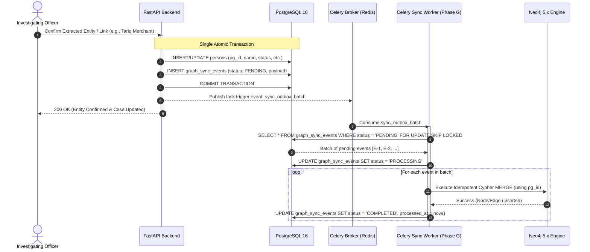

# TRACE-X Graph Synchronization Strategy: Transactional Outbox Pattern

## 1. Overview & Dual-Database Architecture

The **TRACE-X Criminal Network Analysis Platform** operates on a hybrid persistence architecture:
1. **PostgreSQL 16 (System of Record)**: Enforces ACID guarantees, statutory chain-of-custody, RBAC, document extraction ledgers, and append-only audit logging.
2. **Neo4j 5.x (Graph Traversal Engine)**: Powers interactive network exploration (`/cases/:id/network`), multi-hop associate expansion, pathfinding, and Missing Link candidate correlation (`/cases/:id/missing-links`).

### The Dual-Write Challenge
Direct simultaneous writes to both PostgreSQL and Neo4j from API request handlers risk distributed transaction anomalies:
- If PostgreSQL commits but Neo4j fails (network partition, node constraint failure), the graph becomes stale and missing links fail to trigger.
- If Neo4j succeeds but PostgreSQL rolls back, ghost entities exist in the graph without statutory legal custody.
- Two-Phase Commit (2PC) is complex, fragile, and not supported natively across Postgres and Neo4j without severe throughput bottlenecks.

### The Solution: Transactional Outbox Pattern
TRACE-X implements the **Transactional Outbox Pattern**:
- Every time an entity (Person, Phone, Vehicle, Location, Case, CrimeScene) is confirmed or modified in PostgreSQL, an event row is inserted into the `graph_sync_events` table **within the exact same database transaction**.
- A dedicated asynchronous Celery worker (Phase G) pulls pending events from `graph_sync_events`, executes idempotent Cypher `MERGE` queries against Neo4j, and marks the event as completed.
- This guarantees **at-least-once delivery**, **zero data loss**, and **eventual consistency** with sub-second latency.

---

## 2. End-to-End Architecture Flow



---

## 3. PostgreSQL Outbox Schema: `graph_sync_events`

### 3.1. Database Migration DDL

```sql
-- TRACE-X Graph Sync Outbox Table
CREATE TYPE graph_event_type AS ENUM (
    'ENTITY_UPSERT',
    'ENTITY_DELETE',
    'RELATIONSHIP_UPSERT',
    'RELATIONSHIP_DELETE',
    'CASE_LINK_UPSERT'
);

CREATE TYPE graph_sync_status AS ENUM (
    'PENDING',
    'PROCESSING',
    'COMPLETED',
    'FAILED',
    'DEAD_LETTER'
);

CREATE TABLE graph_sync_events (
    id UUID PRIMARY KEY DEFAULT gen_random_uuid(),
    event_type graph_event_type NOT NULL,
    entity_type VARCHAR(50) NOT NULL, -- 'PERSON', 'PHONE', 'VEHICLE', 'LOCATION', 'CASE', 'CRIME_SCENE', 'RELATIONSHIP'
    entity_id VARCHAR(100) NOT NULL,   -- e.g. 'PER-4401', 'CASE-2026-0891'
    pg_id VARCHAR(100) NOT NULL,       -- Postgres primary UUID mapping
    payload JSONB NOT NULL,            -- Full attributes, properties, evidence list
    status graph_sync_status NOT NULL DEFAULT 'PENDING',
    retry_count INT NOT NULL DEFAULT 0,
    max_retries INT NOT NULL DEFAULT 5,
    last_error TEXT,
    created_at TIMESTAMPTZ NOT NULL DEFAULT now(),
    processed_at TIMESTAMPTZ,
    CONSTRAINT check_retries CHECK (retry_count >= 0)
);

-- Performance Indexes for High-Throughput Polling and Status Queries
CREATE INDEX idx_graph_sync_status_created ON graph_sync_events (status, created_at)
WHERE status IN ('PENDING', 'PROCESSING', 'FAILED');

CREATE INDEX idx_graph_sync_entity ON graph_sync_events (entity_type, entity_id);
CREATE INDEX idx_graph_sync_pg_id ON graph_sync_events (pg_id);
```

### 3.2. SQLAlchemy Model Definition

```python
# app/models/graph_sync.py
import enum
import uuid
from sqlalchemy import Column, String, Integer, DateTime, Text, Enum as SQLEnum
from sqlalchemy.dialects.postgresql import UUID, JSONB
from sqlalchemy.sql import func
from app.core.db import Base

class GraphEventType(str, enum.Enum):
    ENTITY_UPSERT = "ENTITY_UPSERT"
    ENTITY_DELETE = "ENTITY_DELETE"
    RELATIONSHIP_UPSERT = "RELATIONSHIP_UPSERT"
    RELATIONSHIP_DELETE = "RELATIONSHIP_DELETE"
    CASE_LINK_UPSERT = "CASE_LINK_UPSERT"

class GraphSyncStatus(str, enum.Enum):
    PENDING = "PENDING"
    PROCESSING = "PROCESSING"
    COMPLETED = "COMPLETED"
    FAILED = "FAILED"
    DEAD_LETTER = "DEAD_LETTER"

class GraphSyncEvent(Base):
    __tablename__ = "graph_sync_events"

    id = Column(UUID(as_uuid=True), primary_key=True, default=uuid.uuid4)
    event_type = Column(SQLEnum(GraphEventType), nullable=False)
    entity_type = Column(String(50), nullable=False, index=True)
    entity_id = Column(String(100), nullable=False, index=True)
    pg_id = Column(String(100), nullable=False, index=True)
    payload = Column(JSONB, nullable=False)
    status = Column(SQLEnum(GraphSyncStatus), default=GraphSyncStatus.PENDING, nullable=False, index=True)
    retry_count = Column(Integer, default=0, nullable=False)
    max_retries = Column(Integer, default=5, nullable=False)
    last_error = Column(Text, nullable=True)
    created_at = Column(DateTime(timezone=True), server_default=func.now(), nullable=False)
    processed_at = Column(DateTime(timezone=True), nullable=True)
```

---

## 4. Staging Sync Events in the Application Transaction

When an investigator confirms an extracted entity (e.g. from an FIR or seizure memo) or creates an association in the workspace, the sync event is staged into the same unit of work:

```python
# app/services/entity_service.py
from sqlalchemy.orm import Session
from app.models.entities import Person
from app.models.graph_sync import GraphSyncEvent, GraphEventType, GraphSyncStatus

def confirm_person_entity(db: Session, person: Person, user_id: uuid.UUID) -> Person:
    # 1. Mutate relational state
    person.status = PersonStatus.SUSPECT
    
    # 2. Stage Outbox Event in identical transaction
    outbox_event = GraphSyncEvent(
        event_type=GraphEventType.ENTITY_UPSERT,
        entity_type="PERSON",
        entity_id=person.person_id,
        pg_id=str(person.id),
        payload={
            "id": person.person_id,
            "pg_id": str(person.id),
            "name": person.full_name,
            "label": person.full_name,
            "sublabel": person.status.value,
            "nodeType": "PERSON",
            "source_type": person.source_type.value,
            "verified": person.source_type.value == "VERIFIED_RECORD",
            "status": person.status.value,
            "risk_level": person.risk_level.value,
            "national_id": person.national_id,
            "primary_address": person.primary_address,
            "aliases": person.aliases or [],
            "evidence_basis": person.evidence_basis or [],
        },
        status=GraphSyncStatus.PENDING,
    )
    db.add(outbox_event)
    
    # 3. Single atomic commit
    db.commit()
    db.refresh(person)
    
    # 4. Trigger Celery worker notification asynchronously
    trigger_sync_task.delay(str(outbox_event.id))
    return person
```

---

## 5. Celery Worker (Phase G) Consumer Specification

The Celery consumer operates in two cooperative modes:
1. **Event-Driven Push**: Triggered immediately when `trigger_sync_task.delay(event_id)` fires on commit.
2. **Scheduled Sweep Poller (Cron)**: Runs every 10 seconds to process any events queued during network blips or backpressure.

### Celery Task Implementation:

```python
# app/tasks/graph_sync_tasks.py
import logging
from datetime import datetime, timezone
from celery import shared_task
from app.core.db import SessionLocal
from app.graph.driver import get_graph_driver
from app.models.graph_sync import GraphSyncEvent, GraphSyncStatus

logger = logging.getLogger("graph_sync_worker")

CYPHER_UPSERT_PERSON = """
MERGE (p:Person {pg_id: $pg_id})
SET p.id = $id,
    p.name = $name,
    p.label = $label,
    p.sublabel = $sublabel,
    p.nodeType = 'PERSON',
    p.source_type = $source_type,
    p.verified = $verified,
    p.status = $status,
    p.risk_level = $risk_level,
    p.national_id = $national_id,
    p.primary_address = $primary_address,
    p.aliases = $aliases,
    p.evidence_basis = $evidence_basis,
    p.updated_at = datetime()
RETURN p.id AS synced_id;
"""

@shared_task(bind=True, max_retries=5, default_retry_delay=5)
def sync_outbox_batch(self, batch_size: int = 50):
    db = SessionLocal()
    driver = get_graph_driver()
    
    try:
        # Atomic lock via PostgreSQL SKIP LOCKED
        events = db.query(GraphSyncEvent).filter(
            GraphSyncEvent.status.in_([GraphSyncStatus.PENDING, GraphSyncStatus.FAILED]),
            GraphSyncEvent.retry_count < GraphSyncEvent.max_retries
        ).order_by(GraphSyncEvent.created_at.asc()).with_for_update(skip_locked=True).limit(batch_size).all()

        if not events:
            return 0

        for event in events:
            event.status = GraphSyncStatus.PROCESSING
        db.commit()

        # Batch write to Neo4j
        with driver.session() as session:
            for event in events:
                try:
                    payload = event.payload
                    cypher_query = select_cypher_template(event.event_type, event.entity_type)
                    session.run(cypher_query, **payload)

                    event.status = GraphSyncStatus.COMPLETED
                    event.processed_at = datetime.now(timezone.utc)
                    event.last_error = None
                except Exception as err:
                    logger.error(f"Sync error for event {event.id}: {err}")
                    event.retry_count += 1
                    event.last_error = str(err)
                    if event.retry_count >= event.max_retries:
                        event.status = GraphSyncStatus.DEAD_LETTER
                    else:
                        event.status = GraphSyncStatus.FAILED

        db.commit()
        return len(events)
    finally:
        db.close()
```

---

## 6. Idempotent Cypher Upsert Templates

All sync operations utilize `MERGE` on `pg_id` to guarantee that replaying events or duplicate deliveries produce identical graph states.

### 6.1. Node Upsert Templates

```cypher
// Person Upsert
MERGE (p:Person {pg_id: $pg_id})
SET p.id = $id,
    p.name = $name,
    p.label = $label,
    p.sublabel = $sublabel,
    p.nodeType = 'PERSON',
    p.source_type = $source_type,
    p.verified = $verified,
    p.status = $status,
    p.risk_level = $risk_level,
    p.national_id = $national_id,
    p.primary_address = $primary_address,
    p.aliases = $aliases,
    p.evidence_basis = $evidence_basis;

// Phone Upsert
MERGE (ph:Phone {pg_id: $pg_id})
SET ph.id = $id,
    ph.number = $number,
    ph.label = $number,
    ph.sublabel = $sublabel,
    ph.subscriber = $subscriber,
    ph.carrier = $carrier,
    ph.evidence_basis = $evidence_basis,
    ph.nodeType = 'PHONE',
    ph.source_type = $source_type,
    ph.verified = $verified;

// Vehicle Upsert
MERGE (v:Vehicle {pg_id: $pg_id})
SET v.id = $id,
    v.plate = $plate,
    v.label = $plate,
    v.sublabel = $model,
    v.model = $model,
    v.chassis_number = $chassis_number,
    v.evidence_basis = $evidence_basis,
    v.nodeType = 'VEHICLE',
    v.source_type = $source_type,
    v.verified = $verified;

// Location Upsert
MERGE (l:Location {pg_id: $pg_id})
SET l.id = $id,
    l.name = $name,
    l.label = $name,
    l.sublabel = $city,
    l.address = $address,
    l.city = $city,
    l.latitude = $latitude,
    l.longitude = $longitude,
    l.evidence_basis = $evidence_basis,
    l.nodeType = 'LOCATION',
    l.source_type = $source_type,
    l.verified = $verified;

// Case Upsert
MERGE (c:Case {pg_id: $pg_id})
SET c.id = $id,
    c.case_number = $case_number,
    c.title = $title,
    c.label = $case_number,
    c.sublabel = $title,
    c.crime_type = $crime_type,
    c.priority = $priority,
    c.status = $status,
    c.station = $station,
    c.nodeType = 'CASE',
    c.source_type = 'VERIFIED_RECORD',
    c.verified = true;

// CrimeScene Upsert
MERGE (cs:CrimeScene {pg_id: $pg_id})
SET cs.id = $id,
    cs.name = $name,
    cs.label = $name,
    cs.sublabel = 'Crime Scene (' + $case_id + ')',
    cs.case_id = $case_id,
    cs.location_address = $address,
    cs.evidence_basis = $evidence_basis,
    cs.nodeType = 'CRIME_SCENE',
    cs.source_type = $source_type,
    cs.verified = $verified;
```

### 6.2. Relationship Upsert Templates (Frontend Legend Aligned)

```cypher
// Relationship Upsert (Generic Template parameterized by $rel_type)
MATCH (source {pg_id: $source_pg_id}), (target {pg_id: $target_pg_id})
MERGE (source)-[r:PHONE_COMMUNICATION]->(target) -- or SHARED_LOCATION, SAME_VEHICLE, SAME_CRIME_SCENE, PREVIOUS_CASE, KNOWN_RELATIONSHIP
SET r.source_type = $source_type,
    r.evidence = $evidence,
    r.confidence = $confidence,
    r.label = $label,
    r.created_at = $created_at;
```

---

## 7. Error Handling, Dead-Letter Queue & Reconciliation

### 7.1. Exponential Backoff & Dead-Letter Queue (DLQ)
- Failed attempts increment `retry_count` and log `last_error`.
- Retries use exponential backoff: $t_{retry} = 2^{retry\_count} \times 5\text{s}$.
- When `retry_count >= max_retries` (5), the record transitions to `DEAD_LETTER`.
- System triggers a statutory alert in the station audit trail (`/audit`) notifying technical officers of an uncommitted graph synchronization event.

### 7.2. Periodic Nightly Reconciliation Cron
To guard against any phantom discrepancies or manual database interventions, a scheduled Celery Beat cron executes at 02:00 IST daily:
1. Queries total entity counts by type in PostgreSQL:
   ```sql
   SELECT 'PERSON' AS type, count(*) FROM persons
   UNION ALL
   SELECT 'PHONE', count(*) FROM phone_numbers
   UNION ALL
   SELECT 'VEHICLE', count(*) FROM vehicles
   UNION ALL
   SELECT 'LOCATION', count(*) FROM locations;
   ```
2. Queries node label counts in Neo4j:
   ```cypher
   CALL apoc.meta.stats() YIELD labels RETURN labels;
   ```
3. If counts differ, the reconciliation script identifies missing `pg_id` values via anti-join, emits compensating `ENTITY_UPSERT` events into `graph_sync_events`, and triggers an outbox replay.
