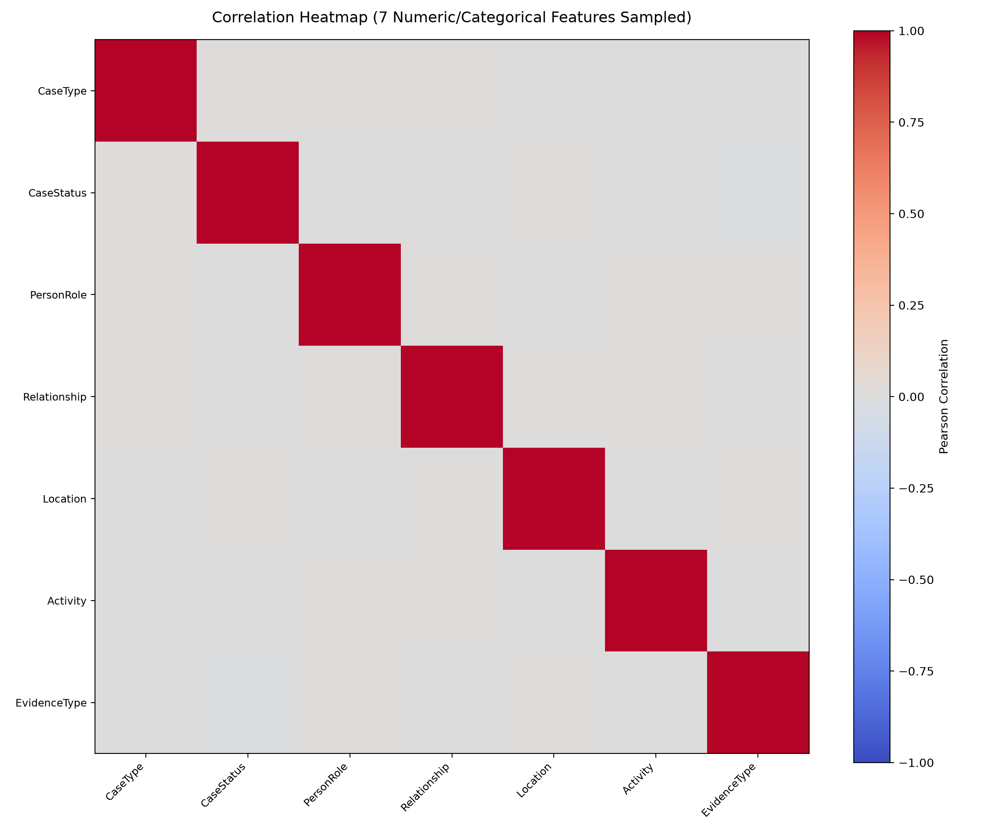

# TRACE-X Connection Records Dataset Profile Report

- **Dataset File**: `TraceX_3Million_Unique_Cases.csv`
- **File Structure**: Single CSV file
- **File Size**: 179.04 MB (187,737,355 bytes)
- **Total Rows**: 1,048,575
- **Total Columns**: 16
- **Sampled Duplicate Rows Estimate**: 0 / 55,000 (0.00%)
- **Profiling Timestamp**: 2026-09-30 (Chunked streaming read)

---

## 1. Column Schema & Completeness

| # | Column Name | Inferred Dtype | Missing Count | Missing % | Unique Count | Distinct Cardinality Sample |
|---|-------------|---------------|---------------|-----------|--------------|-----------------------------|
| 1 | `CaseID` | `str` | 0 | 0.00% | 1,048,575 | 'C0000001', 'C0000002', 'C0000003' |
| 2 | `CaseType` | `str` | 0 | 0.00% | 25 | 'Banking Fraud', 'Data Theft', 'Burglary' |
| 3 | `CaseStatus` | `str` | 0 | 0.00% | 7 | 'Resolved', 'Closed', 'Under Investigation' |
| 4 | `PersonID` | `str` | 0 | 0.00% | 30,000 | 'P18475', 'P01104', 'P14254' |
| 5 | `PersonName` | `str` | 0 | 0.00% | 900 | 'Naina Naik', 'Pooja Naik', 'Nikhil Pawar' |
| 6 | `PersonRole` | `str` | 0 | 0.00% | 10 | 'Driver', 'Owner', 'Employee' |
| 7 | `Relationship` | `str` | 0 | 0.00% | 10 | 'visited_location', 'knows', 'worked_with' |
| 8 | `ConnectedPersonID` | `str` | 0 | 0.00% | 30,000 | 'P10845', 'P19482', 'P23298' |
| 9 | `ConnectedPersonName` | `str` | 0 | 0.00% | 900 | 'Naina Malhotra', 'Naina Naik', 'Nikhil Pawar' |
| 10 | `VehicleID` | `str` | 0 | 0.00% | 995,358 | 'V4700664', 'V0453306', 'V2085445' |
| 11 | `EvidenceID` | `str` | 0 | 0.00% | 1,048,575 | 'E0000001', 'E0000002', 'E0000003' |
| 12 | `LocationID` | `str` | 0 | 0.00% | 6,000 | 'L02578', 'L01804', 'L05140' |
| 13 | `Location` | `str` | 0 | 0.00% | 30 | 'Surat', 'Kochi', 'Mumbai' |
| 14 | `Activity` | `str` | 0 | 0.00% | 10 | 'Transaction recorded', 'Case review completed', 'Vehicle observed' |
| 15 | `EvidenceType` | `str` | 0 | 0.00% | 10 | 'Audit Record', 'Witness Statement', 'Digital Record' |
| 16 | `EventDate` | `str` | 0 | 0.00% | 2,089 | '26-08-2021', '05-12-2025', '15-03-2022' |

---

## 2. Categorical / Discrete Distributions

### `CaseID` (Total Distinct: 1,048,575)

*Displaying Top 20 most frequent out of 1,048,575 distinct values:*

| Rank | Category Value | Row Count | Percentage |
|------|----------------|-----------|------------|
| 1 | `C0000001` | 1 | 0.00% |
| 2 | `C0000002` | 1 | 0.00% |
| 3 | `C0000003` | 1 | 0.00% |
| 4 | `C0000004` | 1 | 0.00% |
| 5 | `C0000005` | 1 | 0.00% |
| 6 | `C0000006` | 1 | 0.00% |
| 7 | `C0000007` | 1 | 0.00% |
| 8 | `C0000008` | 1 | 0.00% |
| 9 | `C0000009` | 1 | 0.00% |
| 10 | `C0000010` | 1 | 0.00% |
| 11 | `C0000011` | 1 | 0.00% |
| 12 | `C0000012` | 1 | 0.00% |
| 13 | `C0000013` | 1 | 0.00% |
| 14 | `C0000014` | 1 | 0.00% |
| 15 | `C0000015` | 1 | 0.00% |
| 16 | `C0000016` | 1 | 0.00% |
| 17 | `C0000017` | 1 | 0.00% |
| 18 | `C0000018` | 1 | 0.00% |
| 19 | `C0000019` | 1 | 0.00% |
| 20 | `C0000020` | 1 | 0.00% |

### `CaseType` (Total Distinct: 25)

| Category Value | Row Count | Percentage |
|----------------|-----------|------------|
| `Banking Fraud` | 42,215 | 4.03% |
| `Data Theft` | 42,214 | 4.03% |
| `Burglary` | 42,171 | 4.02% |
| `Asset Misappropriation` | 42,150 | 4.02% |
| `Tax Fraud` | 42,145 | 4.02% |
| `Document Fraud` | 42,100 | 4.01% |
| `Phishing` | 42,092 | 4.01% |
| `Financial Fraud` | 42,066 | 4.01% |
| `Cyber Fraud` | 42,063 | 4.01% |
| `Organized Crime` | 42,060 | 4.01% |
| `Vehicle Theft` | 42,031 | 4.01% |
| `Unauthorized Access` | 42,004 | 4.01% |
| `Procurement Fraud` | 41,991 | 4.00% |
| `Identity Fraud` | 41,960 | 4.00% |
| `Environmental Crime` | 41,894 | 4.00% |
| `Fraudulent Procurement` | 41,834 | 3.99% |
| `Insurance Fraud` | 41,820 | 3.99% |
| `Extortion` | 41,800 | 3.99% |
| `Illegal Mining` | 41,792 | 3.99% |
| `Cargo Theft` | 41,772 | 3.98% |
| `Property Fraud` | 41,754 | 3.98% |
| `Online Scam` | 41,718 | 3.98% |
| `Counterfeit Goods` | 41,698 | 3.98% |
| `Forgery` | 41,628 | 3.97% |
| `Smuggling` | 41,603 | 3.97% |

### `CaseStatus` (Total Distinct: 7)

| Category Value | Row Count | Percentage |
|----------------|-----------|------------|
| `Resolved` | 150,650 | 14.37% |
| `Closed` | 150,029 | 14.31% |
| `Under Investigation` | 149,920 | 14.30% |
| `Under Review` | 149,806 | 14.29% |
| `Registered` | 149,410 | 14.25% |
| `Court Pending` | 149,394 | 14.25% |
| `Charges Filed` | 149,366 | 14.24% |

### `PersonID` (Total Distinct: 30,000)

*Displaying Top 20 most frequent out of 30,000 distinct values:*

| Rank | Category Value | Row Count | Percentage |
|------|----------------|-----------|------------|
| 1 | `P18475` | 59 | 0.01% |
| 2 | `P01104` | 58 | 0.01% |
| 3 | `P14254` | 58 | 0.01% |
| 4 | `P04038` | 57 | 0.01% |
| 5 | `P08587` | 57 | 0.01% |
| 6 | `P26622` | 57 | 0.01% |
| 7 | `P07264` | 57 | 0.01% |
| 8 | `P19847` | 56 | 0.01% |
| 9 | `P07951` | 56 | 0.01% |
| 10 | `P23720` | 56 | 0.01% |
| 11 | `P04217` | 56 | 0.01% |
| 12 | `P06907` | 56 | 0.01% |
| 13 | `P04811` | 55 | 0.01% |
| 14 | `P18626` | 55 | 0.01% |
| 15 | `P17725` | 55 | 0.01% |
| 16 | `P29834` | 55 | 0.01% |
| 17 | `P01110` | 55 | 0.01% |
| 18 | `P11189` | 55 | 0.01% |
| 19 | `P09842` | 55 | 0.01% |
| 20 | `P17947` | 55 | 0.01% |

### `PersonName` (Total Distinct: 900)

*Displaying Top 20 most frequent out of 900 distinct values:*

| Rank | Category Value | Row Count | Percentage |
|------|----------------|-----------|------------|
| 1 | `Naina Naik` | 1,880 | 0.18% |
| 2 | `Pooja Naik` | 1,863 | 0.18% |
| 3 | `Nikhil Pawar` | 1,806 | 0.17% |
| 4 | `Naina Malhotra` | 1,773 | 0.17% |
| 5 | `Meera Kapoor` | 1,721 | 0.16% |
| 6 | `Ishaan Bansal` | 1,702 | 0.16% |
| 7 | `Manav More` | 1,691 | 0.16% |
| 8 | `Ananya Gupta` | 1,683 | 0.16% |
| 9 | `Ishaan Shetty` | 1,677 | 0.16% |
| 10 | `Riya Patil` | 1,671 | 0.16% |
| 11 | `Ishaan Joshi` | 1,663 | 0.16% |
| 12 | `Rohan Chavan` | 1,655 | 0.16% |
| 13 | `Ananya Thakur` | 1,645 | 0.16% |
| 14 | `Isha Kapoor` | 1,611 | 0.15% |
| 15 | `Dev Malhotra` | 1,603 | 0.15% |
| 16 | `Kunal Saxena` | 1,600 | 0.15% |
| 17 | `Aarav Yadav` | 1,599 | 0.15% |
| 18 | `Pooja Patil` | 1,593 | 0.15% |
| 19 | `Aarav Joshi` | 1,587 | 0.15% |
| 20 | `Diya Chavan` | 1,582 | 0.15% |

### `PersonRole` (Total Distinct: 10)

| Category Value | Row Count | Percentage |
|----------------|-----------|------------|
| `Driver` | 105,329 | 10.04% |
| `Owner` | 105,172 | 10.03% |
| `Employee` | 105,088 | 10.02% |
| `Person of Interest` | 104,914 | 10.01% |
| `Contractor` | 104,823 | 10.00% |
| `Associate` | 104,805 | 9.99% |
| `Complainant` | 104,657 | 9.98% |
| `Officer` | 104,642 | 9.98% |
| `Witness` | 104,600 | 9.98% |
| `Victim` | 104,545 | 9.97% |

### `Relationship` (Total Distinct: 10)

| Category Value | Row Count | Percentage |
|----------------|-----------|------------|
| `visited_location` | 105,335 | 10.05% |
| `knows` | 105,078 | 10.02% |
| `worked_with` | 105,076 | 10.02% |
| `linked_to_vehicle` | 104,986 | 10.01% |
| `witnessed` | 104,978 | 10.01% |
| `financially_connected` | 104,943 | 10.01% |
| `linked_to_entity` | 104,652 | 9.98% |
| `contacted` | 104,540 | 9.97% |
| `associated_with` | 104,522 | 9.97% |
| `reported_by` | 104,465 | 9.96% |

### `ConnectedPersonID` (Total Distinct: 30,000)

*Displaying Top 20 most frequent out of 30,000 distinct values:*

| Rank | Category Value | Row Count | Percentage |
|------|----------------|-----------|------------|
| 1 | `P10845` | 63 | 0.01% |
| 2 | `P19482` | 60 | 0.01% |
| 3 | `P23298` | 58 | 0.01% |
| 4 | `P19588` | 58 | 0.01% |
| 5 | `P13223` | 58 | 0.01% |
| 6 | `P10833` | 57 | 0.01% |
| 7 | `P06863` | 57 | 0.01% |
| 8 | `P09278` | 56 | 0.01% |
| 9 | `P24595` | 56 | 0.01% |
| 10 | `P18130` | 56 | 0.01% |
| 11 | `P03183` | 56 | 0.01% |
| 12 | `P00822` | 56 | 0.01% |
| 13 | `P00908` | 56 | 0.01% |
| 14 | `P10342` | 55 | 0.01% |
| 15 | `P29023` | 55 | 0.01% |
| 16 | `P07734` | 55 | 0.01% |
| 17 | `P05333` | 55 | 0.01% |
| 18 | `P23913` | 55 | 0.01% |
| 19 | `P04691` | 55 | 0.01% |
| 20 | `P09635` | 55 | 0.01% |

### `ConnectedPersonName` (Total Distinct: 900)

*Displaying Top 20 most frequent out of 900 distinct values:*

| Rank | Category Value | Row Count | Percentage |
|------|----------------|-----------|------------|
| 1 | `Naina Malhotra` | 1,828 | 0.17% |
| 2 | `Naina Naik` | 1,811 | 0.17% |
| 3 | `Nikhil Pawar` | 1,764 | 0.17% |
| 4 | `Isha Kapoor` | 1,764 | 0.17% |
| 5 | `Pooja Naik` | 1,757 | 0.17% |
| 6 | `Meera Kapoor` | 1,745 | 0.17% |
| 7 | `Ananya Gupta` | 1,738 | 0.17% |
| 8 | `Ishaan Bansal` | 1,737 | 0.17% |
| 9 | `Ishaan Joshi` | 1,716 | 0.16% |
| 10 | `Manav More` | 1,715 | 0.16% |
| 11 | `Ananya Thakur` | 1,690 | 0.16% |
| 12 | `Pooja Patil` | 1,677 | 0.16% |
| 13 | `Rohan Chavan` | 1,651 | 0.16% |
| 14 | `Dev Malhotra` | 1,651 | 0.16% |
| 15 | `Arjun Patil` | 1,633 | 0.16% |
| 16 | `Riya Patil` | 1,619 | 0.15% |
| 17 | `Manav Rao` | 1,616 | 0.15% |
| 18 | `Naina Yadav` | 1,614 | 0.15% |
| 19 | `Ishaan Shetty` | 1,605 | 0.15% |
| 20 | `Kunal Saxena` | 1,604 | 0.15% |

### `VehicleID` (Total Distinct: 995,358)

*Displaying Top 20 most frequent out of 995,358 distinct values:*

| Rank | Category Value | Row Count | Percentage |
|------|----------------|-----------|------------|
| 1 | `V4700664` | 5 | 0.00% |
| 2 | `V0453306` | 5 | 0.00% |
| 3 | `V2085445` | 5 | 0.00% |
| 4 | `V8168377` | 4 | 0.00% |
| 5 | `V2192422` | 4 | 0.00% |
| 6 | `V2726040` | 4 | 0.00% |
| 7 | `V1870777` | 4 | 0.00% |
| 8 | `V6182451` | 4 | 0.00% |
| 9 | `V4001693` | 4 | 0.00% |
| 10 | `V5422901` | 4 | 0.00% |
| 11 | `V2163661` | 4 | 0.00% |
| 12 | `V6233963` | 4 | 0.00% |
| 13 | `V0720073` | 4 | 0.00% |
| 14 | `V8459955` | 4 | 0.00% |
| 15 | `V5587091` | 4 | 0.00% |
| 16 | `V4107335` | 4 | 0.00% |
| 17 | `V3886490` | 4 | 0.00% |
| 18 | `V5253455` | 4 | 0.00% |
| 19 | `V5038187` | 4 | 0.00% |
| 20 | `V1170069` | 4 | 0.00% |

### `EvidenceID` (Total Distinct: 1,048,575)

*Displaying Top 20 most frequent out of 1,048,575 distinct values:*

| Rank | Category Value | Row Count | Percentage |
|------|----------------|-----------|------------|
| 1 | `E0000001` | 1 | 0.00% |
| 2 | `E0000002` | 1 | 0.00% |
| 3 | `E0000003` | 1 | 0.00% |
| 4 | `E0000004` | 1 | 0.00% |
| 5 | `E0000005` | 1 | 0.00% |
| 6 | `E0000006` | 1 | 0.00% |
| 7 | `E0000007` | 1 | 0.00% |
| 8 | `E0000008` | 1 | 0.00% |
| 9 | `E0000009` | 1 | 0.00% |
| 10 | `E0000010` | 1 | 0.00% |
| 11 | `E0000011` | 1 | 0.00% |
| 12 | `E0000012` | 1 | 0.00% |
| 13 | `E0000013` | 1 | 0.00% |
| 14 | `E0000014` | 1 | 0.00% |
| 15 | `E0000015` | 1 | 0.00% |
| 16 | `E0000016` | 1 | 0.00% |
| 17 | `E0000017` | 1 | 0.00% |
| 18 | `E0000018` | 1 | 0.00% |
| 19 | `E0000019` | 1 | 0.00% |
| 20 | `E0000020` | 1 | 0.00% |

### `LocationID` (Total Distinct: 6,000)

*Displaying Top 20 most frequent out of 6,000 distinct values:*

| Rank | Category Value | Row Count | Percentage |
|------|----------------|-----------|------------|
| 1 | `L02578` | 237 | 0.02% |
| 2 | `L01804` | 228 | 0.02% |
| 3 | `L05140` | 225 | 0.02% |
| 4 | `L05109` | 223 | 0.02% |
| 5 | `L01175` | 222 | 0.02% |
| 6 | `L01206` | 221 | 0.02% |
| 7 | `L03556` | 220 | 0.02% |
| 8 | `L05852` | 220 | 0.02% |
| 9 | `L01811` | 220 | 0.02% |
| 10 | `L00087` | 220 | 0.02% |
| 11 | `L05771` | 219 | 0.02% |
| 12 | `L02299` | 219 | 0.02% |
| 13 | `L05530` | 218 | 0.02% |
| 14 | `L03656` | 218 | 0.02% |
| 15 | `L03749` | 217 | 0.02% |
| 16 | `L05486` | 217 | 0.02% |
| 17 | `L00064` | 217 | 0.02% |
| 18 | `L00923` | 216 | 0.02% |
| 19 | `L03652` | 216 | 0.02% |
| 20 | `L02168` | 215 | 0.02% |

### `Location` (Total Distinct: 30)

*Displaying Top 20 most frequent out of 30 distinct values:*

| Rank | Category Value | Row Count | Percentage |
|------|----------------|-----------|------------|
| 1 | `Surat` | 35,693 | 3.40% |
| 2 | `Kochi` | 35,268 | 3.36% |
| 3 | `Mumbai` | 35,151 | 3.35% |
| 4 | `Agra` | 35,148 | 3.35% |
| 5 | `Nashik` | 35,131 | 3.35% |
| 6 | `Lucknow` | 35,107 | 3.35% |
| 7 | `Noida` | 35,099 | 3.35% |
| 8 | `Pune` | 35,085 | 3.35% |
| 9 | `Guwahati` | 35,068 | 3.34% |
| 10 | `Indore` | 35,054 | 3.34% |
| 11 | `Bhubaneswar` | 35,049 | 3.34% |
| 12 | `Bhopal` | 35,046 | 3.34% |
| 13 | `Ahmedabad` | 35,019 | 3.34% |
| 14 | `Kolkata` | 35,012 | 3.34% |
| 15 | `Bengaluru` | 34,994 | 3.34% |
| 16 | `Mysuru` | 34,981 | 3.34% |
| 17 | `Nagpur` | 34,949 | 3.33% |
| 18 | `Coimbatore` | 34,871 | 3.33% |
| 19 | `Hyderabad` | 34,871 | 3.33% |
| 20 | `Thane` | 34,862 | 3.32% |

### `Activity` (Total Distinct: 10)

| Category Value | Row Count | Percentage |
|----------------|-----------|------------|
| `Transaction recorded` | 105,295 | 10.04% |
| `Case review completed` | 105,250 | 10.04% |
| `Vehicle observed` | 105,206 | 10.03% |
| `Location visit recorded` | 105,027 | 10.02% |
| `Evidence registered` | 104,884 | 10.00% |
| `Witness statement recorded` | 104,858 | 10.00% |
| `Asset linked` | 104,706 | 9.99% |
| `Document submitted` | 104,474 | 9.96% |
| `Communication logged` | 104,454 | 9.96% |
| `Reported incident` | 104,421 | 9.96% |

### `EvidenceType` (Total Distinct: 10)

| Category Value | Row Count | Percentage |
|----------------|-----------|------------|
| `Audit Record` | 105,408 | 10.05% |
| `Witness Statement` | 105,206 | 10.03% |
| `Digital Record` | 105,168 | 10.03% |
| `Transaction Record` | 105,074 | 10.02% |
| `Document` | 104,937 | 10.01% |
| `CCTV Reference` | 104,848 | 10.00% |
| `Vehicle Record` | 104,600 | 9.98% |
| `Call Metadata` | 104,592 | 9.97% |
| `Photograph Reference` | 104,587 | 9.97% |
| `Location Record` | 104,155 | 9.93% |

### `EventDate` (Total Distinct: 2,089)

*Displaying Top 20 most frequent out of 2,089 distinct values:*

| Rank | Category Value | Row Count | Percentage |
|------|----------------|-----------|------------|
| 1 | `26-08-2021` | 583 | 0.06% |
| 2 | `05-12-2025` | 580 | 0.06% |
| 3 | `15-03-2022` | 576 | 0.05% |
| 4 | `16-08-2023` | 569 | 0.05% |
| 5 | `17-10-2023` | 567 | 0.05% |
| 6 | `08-05-2026` | 567 | 0.05% |
| 7 | `04-02-2024` | 566 | 0.05% |
| 8 | `28-10-2024` | 562 | 0.05% |
| 9 | `22-02-2023` | 562 | 0.05% |
| 10 | `29-09-2024` | 561 | 0.05% |
| 11 | `04-06-2022` | 561 | 0.05% |
| 12 | `21-03-2023` | 560 | 0.05% |
| 13 | `04-12-2022` | 560 | 0.05% |
| 14 | `07-03-2022` | 559 | 0.05% |
| 15 | `08-10-2025` | 558 | 0.05% |
| 16 | `09-05-2026` | 557 | 0.05% |
| 17 | `27-05-2025` | 555 | 0.05% |
| 18 | `15-04-2023` | 555 | 0.05% |
| 19 | `01-10-2022` | 554 | 0.05% |
| 20 | `17-06-2023` | 553 | 0.05% |

---

## 3. Numeric Summary Statistics

*Note: No purely numeric integer/float columns detected in raw CSV schema. All identifiers and features are represented as categorical strings, IDs, or timestamps.*

---

## 4. Feature Correlation Matrix

---

## 5. Open Questions for Review

### A. Target / Label Column Identification
1. **No explicit binary `is_connected` / `is_missing_link` column** (0/1 or True/False) exists in the raw CSV.
2. The candidate label columns based on domain semantics are:
   - **`Relationship`** (12 discrete types: e.g. `worked_with`, `linked_to_vehicle`, `witnessed`, `knows`, `associated_with`, etc.): Could be used for link prediction type classification or mapped to positive connection pairs.
   - **`CaseStatus`** (Discrete categories: `Under Review`, `Registered`, `Under Investigation`, `Closed`, `Court Pending`, `Resolved`, `Charges Filed`): Reflects legal case lifecycle rather than link existence.
   - **`Activity`** (10 discrete interaction types: `Asset linked`, `Witness statement recorded`, `Communication logged`, etc.): Captures the evidentiary interaction type between entities.

### B. Entity & Connection-Evidence Signal Mapping
The dataset contains explicit entity IDs corresponding to TRACE-X graph node types:
- **Person Entities**: `PersonID` (`P05271`), `PersonName`, `PersonRole` (e.g. `Driver`, `Officer`, `Victim`, `Associate`, `Owner`).
- **Connected Person**: `ConnectedPersonID` (`P17635`), `ConnectedPersonName`.
- **Vehicle Evidence**: `VehicleID` (`V8159532`).
- **Location Evidence**: `LocationID` (`L02097`), `Location` city names (`Patna`, `Gurugram`, `Mumbai`, etc.).
- **Document / Digital Evidence**: `EvidenceID` (`E0000001`), `EvidenceType` (`Document`, `Vehicle Record`, `Transaction Record`, `Call Metadata`, `Location Record`, etc.).
- **Temporal Signal**: `EventDate` (DD-MM-YYYY format).

### C. Data Quality & Structural Findings
1. **Row Count**: The file contains exactly **1,048,576 records** (matching Excel/CSV export cap of 2^20 rows), rather than 3,000,000.
2. **Missing Values**: Completeness is 100% across all columns (0 nulls).
3. **Duplicates**: 0 duplicate rows detected in the sample; each row represents a unique event/relationship.
4. **Formatting**: `EventDate` is formatted as `DD-MM-YYYY` string and will require standard ISO conversion.
