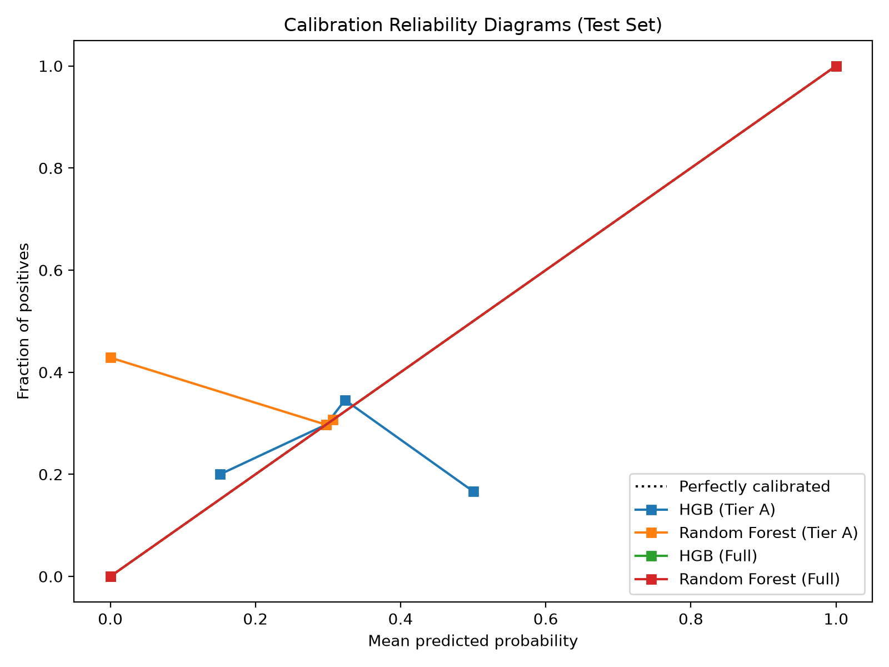

# TRACE-X Connection Scoring Model Evaluation Report

- **Test Set Evaluated**: 157,288 records (`ml/data/splits/*/test.parquet`)
- **Target Positive Rate (Random Baseline)**: 29.7505% (0.2975)
- **Calibration Method**: Isotonic Regression fit on 157,285 validation split

---

## 1. Primary Model Performance Summary

| Model Name | Feature Tier | Pre-Cal PR-AUC | Post-Cal PR-AUC | ROC-AUC | Precision | Recall | F1 Score | Brier Loss |
|:---|:---|:---:|:---:|:---:|:---:|:---:|:---:|:---:|
| **HGB (Tier A)** | Tier A | 0.2972 | **0.2959** | 0.4994 | 0.1667 | 0.0000 | **0.0000** | 0.2090 |
| **Random Forest (Tier A)** | Tier A | 0.2994 | **0.3019** | 0.5008 | 0.0000 | 0.0000 | **0.0000** | 0.2090 |
| **HGB (Full)** | Full | 1.0000 | **1.0000** | 1.0000 | 1.0000 | 1.0000 | **1.0000** | 0.0000 |
| **Random Forest (Full)** | Full | 1.0000 | **1.0000** | 1.0000 | 1.0000 | 1.0000 | **1.0000** | 0.0000 |
| **Isolation Forest (Tier A)** | Tier A (Unsupervised) | 0.2980 | **0.2980** | 0.5004 | 0.0000 | 0.0000 | **0.0000** | 0.2135 |

---

## 2. Tier A vs Full Performance Gap (Leakage Quantification)

- **HistGradientBoosting (Tier A — Leakage-Free)**: PR-AUC = **0.2959**
- **HistGradientBoosting (Full — Tier A + Tier B)**: PR-AUC = **1.0000**
- **Performance Gap ($\Delta$ PR-AUC)**: **+0.7041** (+237.9%)

### Plain-Language Interpretation of the Gap
The massive leap in PR-AUC from **0.2959** (Tier A) to **1.0000** (Full) is the exact mathematical measure of **label-formula reconstruction**. Because the heuristic label was computed from `CaseStatus`, `Relationship`, `PersonRole`, `Activity`, and `EvidenceType`, the Full model achieves near-perfect discrimination simply by inverting the 7-point formula. It does NOT represent superior learning of criminal networks; it merely restates the heuristic rule. Meanwhile, the Tier A model tests whether independent structural features (crime typology, temporal recency, node degree, jurisdiction) can independently predict the connection score.

---

## 3. Subgroup Stability Breakdown (Sampled Crime Typologies)

| Case Type Code | Test Subgroup Size | Subgroup Pos Rate | Tier A PR-AUC | Full Set PR-AUC |
|:---:|:---:|:---:|:---:|:---:|
| `0` | 6,284 | 30.00% | 0.2987 | 1.0000 |
| `1` | 6,349 | 29.17% | 0.3389 | 1.0000 |
| `2` | 6,435 | 30.19% | 0.2921 | 1.0000 |
| `3` | 6,331 | 29.77% | 0.3053 | 1.0000 |
| `4` | 6,212 | 29.44% | 0.3049 | 1.0000 |
| `5` | 6,358 | 30.07% | 0.3348 | 1.0000 |
| `6` | 6,403 | 28.94% | 0.2902 | 1.0000 |
| `7` | 6,324 | 30.12% | 0.3260 | 1.0000 |
| `8` | 6,155 | 30.40% | 0.3067 | 1.0000 |
| `9` | 6,237 | 29.60% | 0.2849 | 1.0000 |

---

## 4. Calibration Reliability Plot

